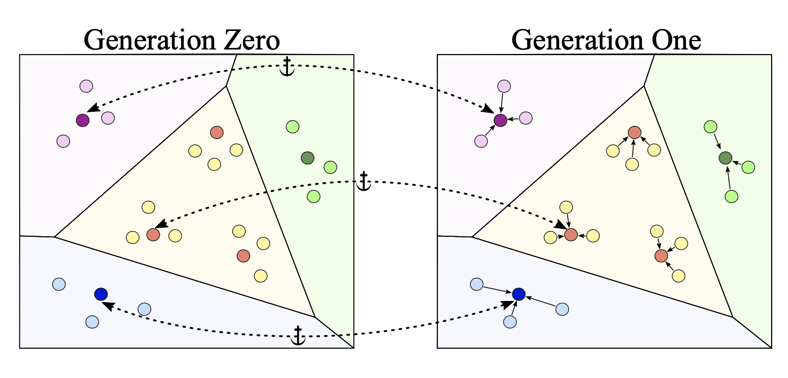
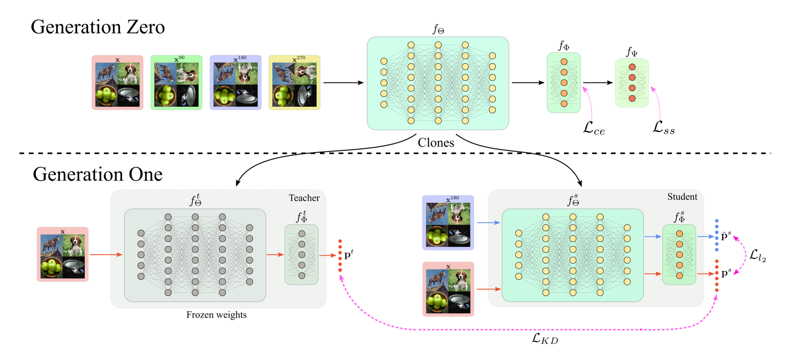
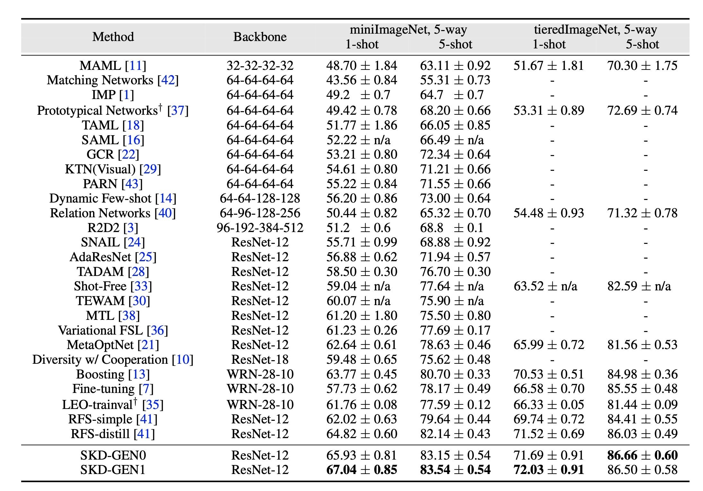
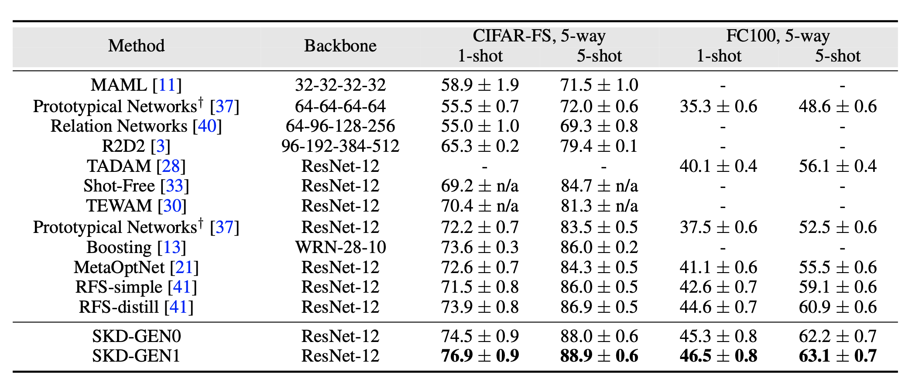

# SKD : Self-supervised Knowledge Distillation for Few-shot Learning
Official implementation of "SKD : Self-supervised Knowledge Distillation for Few-shot Learning". [(paper link)](https://arxiv.org/abs/2003.11652). The paper reports state-of-the-art results on four popular few-shot learning benchmarks. 

Real-world contains an overwhelmingly large number of object classes, learning all of which at once is impossible. Few shot learning is a promising learning paradigm due to its ability to learn out of order distributions quickly with only a few samples. Recent works show that simply learning a good feature embedding can outperform more sophisticated meta-learning and metric learning algorithms. In this paper, we propose a simple approach to improve the representation capacity of deep neural networks for few-shot learning tasks. We follow a two-stage learning process: First, we train a neural network to maximize the entropy of the feature embedding, thus creating an optimal output manifold using self-supervision as an auxiliary loss. In the second stage, we minimize the entropy on feature embedding by bringing self-supervised twins together, while constraining the manifold with student-teacher distillation. Our experiments show that, even in the first stage, auxiliary self-supervision can outperform current state-of-the-art methods, with further gains achieved by our second stage distillation process.

This official code provides an implementation for our SKD. This repository is implemented using PyTorch and it includes code for running the few-shot learning experiments on **CIFAR-FS**, **FC-100**, **miniImageNet** and **tieredImageNet** datasets.

<p align="center"></p>
<p align="center"><b>(a)</b> SKD has two stage learning. In <code>Gen-0</code>, self-supervision is used to estimate the true prediction manifold, equivariant to input transformations. Specifically, we enforce the model to predict the amount of input rotation using only the output logits. In <code>Gen-1</code>, we force the original sample outputs to be the same as in <code>Gen-0</code> (dotted lines), while reducing its distance with its augmented versions to enhance discriminability.</p>

<p align="center"></p>
<p align="center"><b>(b)</b> SKD training pipeline.</p>

## Dependencies
This code requires the following:
* matplotlib==3.2.1
* mkl==2019.0
* numpy==1.18.4
* Pillow==7.1.2
* scikit_learn==0.23.1
* scipy==1.4.1
* torch==1.5.0
* torchvision==0.6.0
* tqdm==4.46.0
* wandb==0.8.36

run `pip3 install -r requirements.txt` to install all the dependencies. 

## Download Data
The data we used here is preprocessed by the repo of [MetaOptNet](https://github.com/kjunelee/MetaOptNet), Please find the renamed versions of the files in below link by [RFS](https://github.com/WangYueFt/rfs).

[[DropBox Data Packages Link]](https://www.dropbox.com/sh/6yd1ygtyc3yd981/AABVeEqzC08YQv4UZk7lNHvya?dl=0)
    
## Training

### Generation Zero
To perform the Generation Zero experiment, run: 

`python3 train_supervised_ssl.py --tags cifarfs,may30 --model resnet12_ssl --model_path save/backup --dataset CIFAR-FS --data_root ../../Datasets/CIFAR_FS/ --n_aug_support_samples 5 --n_ways 5 --n_shots 1 --epochs 65 --lr_decay_epochs 60 --gamma 2.0`

WANDB will create unique names for each runs, and save the model names accordingly. Use this name for the teacher in the next experiment.


### Generation One
To perform the Generation One experiment, run: 

`python3 train_distillation.py --tags cifarfs,gen1,may30 --model_s resnet12_ssl --model_t resnet12_ssl --path_t save/backup/resnet12_ssl_CIFAR-FS_lr_0.05_decay_0.0005_trans_D_trial_1/model_firm-sun-1.pth --model_path save/backup --dataset CIFAR-FS --data_root ../../Datasets/CIFAR_FS/ --n_aug_support_samples 5 --n_ways 5 --n_shots 1 --epochs 65 --lr_decay_epochs 60 --gamma 0.1`


### Evaluation

`python3 eval_fewshot.py --model resnet12_ssl --model_path save/backup2/resnet12_ssl_toy_lr_0.05_decay_0.0005_trans_A_trial_1/model_firm-sun-1.pth --dataset toy --data_root ../../Datasets/CIFAR_FS/ --n_aug_support_samples 5 --n_ways 5 --n_shots 1`


## Results

We perform extensive experiments on four datasets in a few-shot learning setting, leading to significant improvements over the state of the art methods.

<p align="center"></p>
<p align="center">(c) SKD performance on miniImageNet and tieredImageNet.</p>
<br/>
<br/>
<p align="center"></p>
<p align="center">(d) SKD performance on CIFAR-FS and FC100 datasets.</p>


## We Credit
Thanks to https://github.com/WangYueFt/rfs, for the preliminary implementations.

## Contact
Jathushan Rajasegaran - jathushan.rajasegaran@inceptioniai.org or brjathu@gmail.com
<br/>
To ask questions or report issues, please open an issue on the [issues tracker](https://github.com/brjathu/SKD/issues).
<br/>
Discussions, suggestions and questions are welcome!


## Citation
```
@article{rajasegaran2020self,
  title={Self-supervised Knowledge Distillation for Few-shot Learning},
  author={Rajasegaran, Jathushan and Khan, Salman and Hayat, Munawar and Khan, Fahad Shahbaz and Shah, Mubarak},
  journal={arxiv},
  year = {2020}
}
```
